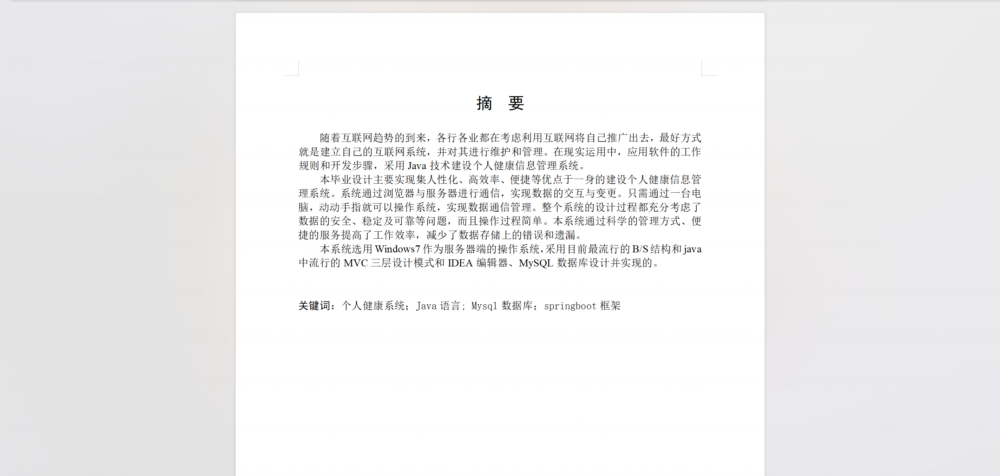

基于Springboot的个人健康管理系统（程序+论文）
=

### 完整代码获取地址：从戎源码网 ([https://armycodes.com/](https://armycodes.com/))
### 作者微信：19941326836  QQ：952045282 
### 承接计算机毕业设计、Java毕业设计、Python毕业设计、深度学习、机器学习
### 选题+开题报告+任务书+程序定制+安装调试+论文+答辩ppt 一条龙服务
### 所有选题地址https://github.com/nature924/allProject

一、项目介绍
---

基于SpringBoot+Vue的个人健康管理系统，系统角色为系统管理员、普通用户，主要功能如下

系统管理员：
基本操作：登录、注册、修改密码、获取个人信息、修改个人信息、退出登录
用户管理：筛选用户（用户名、手机号）、分页查询、查看用户详情、新增用户、修改用户、删除用户
角色管理：筛选角色、分页查询、查看角色详情、新增角色、修改角色、删除角色、获取全部角色
菜单管理：获取菜单列表、按用户下发菜单（基于角色权限）
身体信息管理：筛选身体信息（姓名、ID）、分页查询、查看身体信息详情、上传/更新基础体征信息、添加体征记录、修改体征记录、删除体征记录
运动知识管理：筛选运动知识（类型）、分页查询、查看运动知识详情、新增运动知识、修改运动知识、删除运动知识、获取全部运动知识
运动详情管理：按运动名称获取详情、按类型筛选、分页查询、查看详情、新增详情、修改详情、删除详情
健康提醒管理：查询提醒列表（关键字、类型、优先级、是否已读、分页）、新增提醒、修改提醒、删除提醒、标记已读、全部标记已读、获取未读数量
心理健康管理：保存心理健康测试结果、获取最近一次测试结果、查看心理健康测试历史记录

普通用户：
基本操作：登录、注册、修改密码、获取个人信息、修改个人信息、退出登录
身体信息管理：上传/更新基础体征信息、添加体征记录、查看个人体征记录列表、查看体征记录详情、修改体征记录、删除体征记录
运动知识管理：浏览运动知识列表、按类型筛选、查看运动知识详情
运动详情管理：按运动名称查看详情、按类型筛选、分页查看
健康提醒管理：查看个人提醒列表（关键字、类型、优先级、是否已读、分页）、新增提醒、修改提醒、删除提醒、标记已读、全部标记已读、查看未读数量
心理健康管理：进行心理健康测试、保存测试结果、查看最新结果、查看历史记录

二、项目技术
---
- 编程语言：Java
- 数据库：MySQL
- 项目管理工具：Maven
- 前端技术：VUE、HTML、Jquery、Bootstrap
- 后端技术：Spring、SpringMVC、MyBatis

三、运行环境
---
- 操作系统：Windows、macOS都可以
- JDK版本：JDK1.8以上都可以
- 开发工具：IDEA、Ecplise、Myecplise都可以
- 数据库: MySQL5.7以上都可以
- Tomcat：任意版本都可以
- Maven：任意版本都可以

四、运行截图
---
### 论文截图：

### 程序截图：

